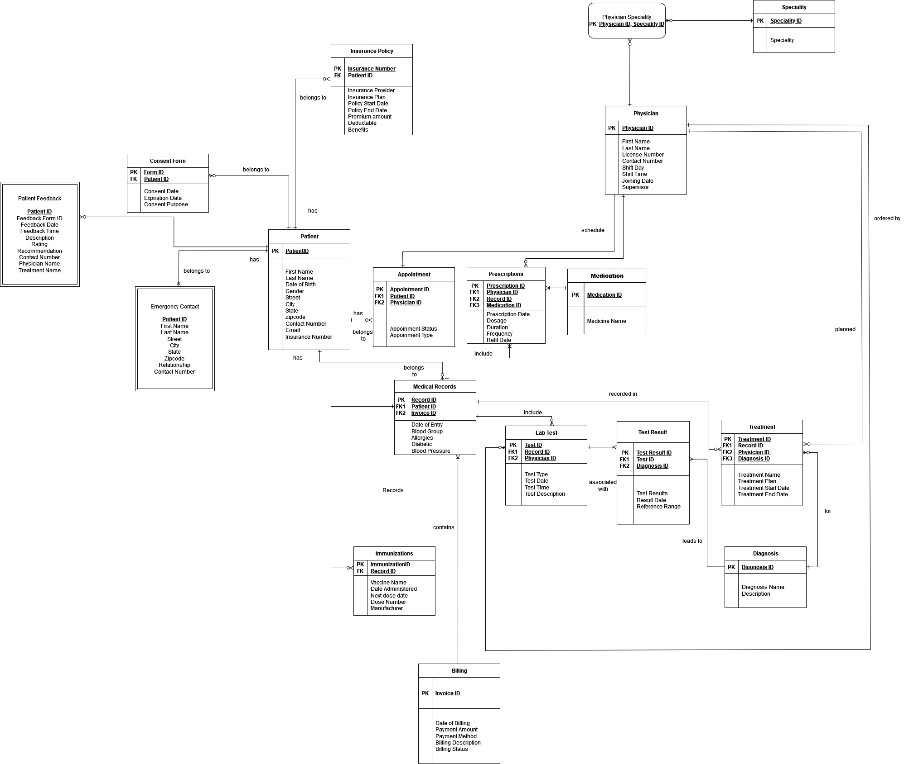

# Patient Record Management System 🏥

## Overview
The **Patient Record Management System** is a CRUD-based healthcare application designed to streamline patient record management, ensuring efficiency, security, and easy access to medical data.

## ER Diagram
Below is the **Entity-Relationship Diagram (ERD)** for the system:

This ERD illustrates the relationships between key entities such as **Patients, Physicians, Appointments, Prescriptions, Medical Records, Insurance Policies**, and more.

## Key Features
✅ **Patient Management:** Store and update patient records, including demographics, medical history, and emergency contacts.  
✅ **Appointment Scheduling:** Track and manage patient appointments with physicians.  
✅ **Medical Records & Lab Test Tracking:** Maintain treatment history, lab tests, and diagnoses.  
✅ **Billing & Insurance:** Handle patient billing, payments, and insurance claims.  
✅ **Consent & Emergency Contact Management:** Ensure compliance with legal and ethical healthcare regulations.  
✅ **Feedback System:** Collect patient feedback to improve healthcare services.  

## CRUD Functionality
This system enables:
- **Create** new patient records, appointments, prescriptions, and billing details.
- **Read** and retrieve patient history, physician schedules, and test results.
- **Update** existing records such as treatment plans, insurance details, and prescriptions.
- **Delete** outdated or incorrect records while maintaining compliance.

## Contributors  
- **Nitin Varma Indukuri**  
- **Vaishnavi Veerkumar**
- **Kalash Desai**
- **Linata Rajendra Deshmukh**
- **Om Satya Swaroop Arepalli**

